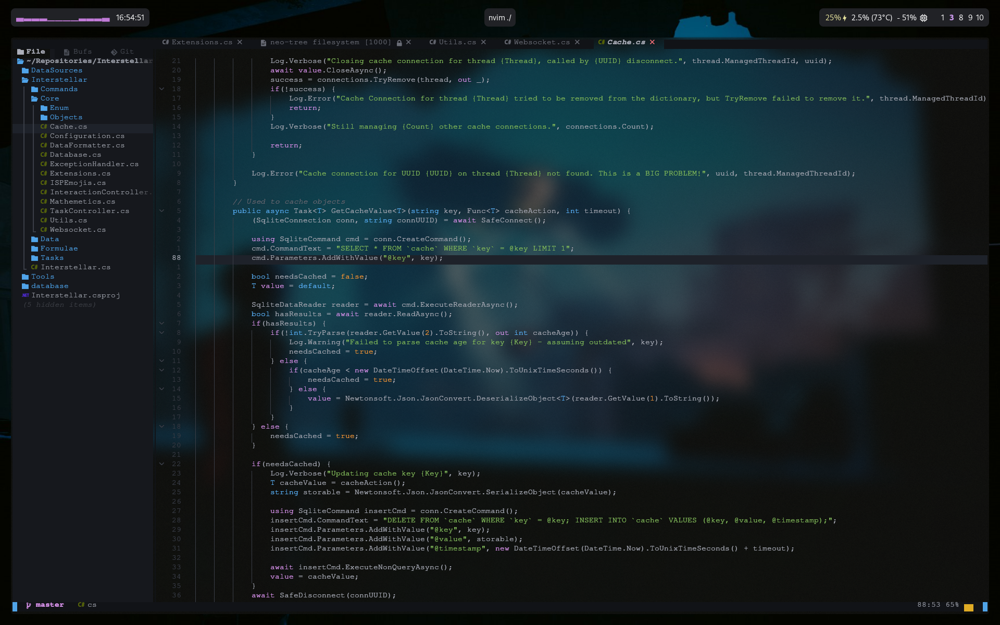
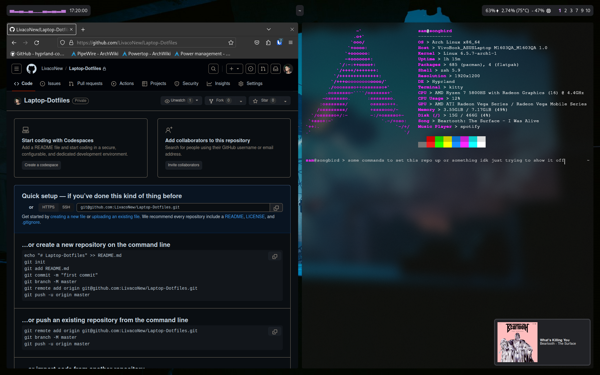

# Laptop Dotfiles 



### Overview
Designed for Host: ASUS Vivobook 16X  
OS: Arch Linux  
Desktop Manager: Hyprland  
Shell: ZSH  
Terminal: Kitty  
Web Browser: Firefox  

Most required packages can be found in PACKAGES. Not everything is there though, so you may have to manually go install some stuff.
I'm new to this whole dotfile sharing business so apologies if I'm making things inconvenient lol.

### Some Notes if your stupid enough to use this
- Make sure to give execute privilages to all scripts in the .scripts folder if you want any of them to work.
- If your on a different laptop/machine than I am, you'll more than likely have to change the keycodes and stuff for yours in the scripts/hyprland configurations.
- You'll also have to change the Trackpad device in .scripts/TrackpadToggle.sh if you want to be able to use the disable trackpad function. Grab your device name using `hyprctl devices` and replace the `DEVICE` value at the top with it.
- You'll have to change the SDDM theme manually in `/etc/sddm.conf` if you want to use the sddm-elegant-theme-git theme I use. Just put this in the file:
```
[Theme]
Current=Elegant
```
- The wallpaper file is in .config/hypr/Wallpaper.png, and gets preloaded on hyprpaper initialization.
- Hyprland is setup to auto-start a kitty instance running htop on workspace 10. This is just for me to have some quick monitoring if my laptop starts acting up, so feel free to disable it.
- Neovim is the text editor of choice. Because I'm lazy and use Astronvim, **you'll have to install it manually** so I'm not trampling on any licenced toes.
    - An important note about this is a stock config won't have the transparent background I have in the photos. To enable this, go into `.config/nvim/lua/plugins/core.lua` and change the `astrotheme` entry to look like this:
```lua
{ "AstroNvim/astrotheme", opts = { 
    style = {
        transparent = true,
    },
    plugins = { ["dashboard-nvim"] = true } } 
},
```

### Is this outdated?
Probably. I'm always changing about stuff, and I'll more than likely forget to update this repo in the progress.
